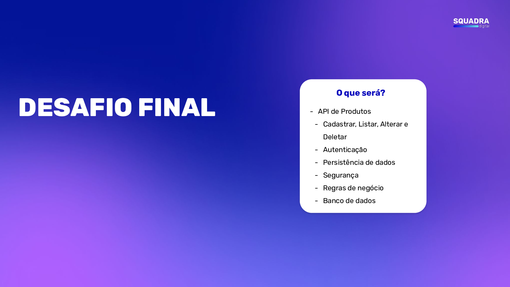
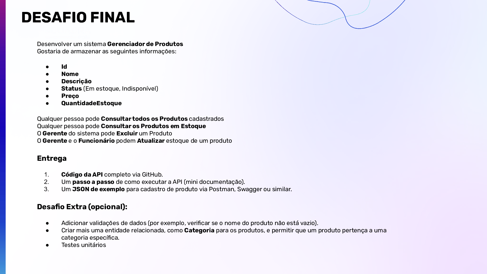

<h1 align="center">
    **DESAFIO FINAL | New Thinkers 2024.2 [.NET] | SQUADRA DIGITAL**
</h1>

---

## Escopo do Desafio:

---

## Descrição do projeto
Este projeto é uma API .NET desenvolvida para gerenciar produtos em um mercado. A aplicação oferece operações CRUD (Create, Read, Update, Delete) para manipular os produtos no banco de dados. A arquitetura Clean Architecture é usada para garantir uma separação clara de responsabilidades, incluindo camadas Application, Domain, Data e IoC. O código segue princípios de Clean Code para manutenção e legibilidade.**Nota:** Essa API foi desenvolvida Exclusivamente para o Desafio Final do Programa New Thinkers 2024.2 da Squadra Digital. 

<h3 align="center">
    <a href="https://learn.microsoft.com/pt-br/aspnet/core/introduction-to-aspnet-core?view=aspnetcore-7.0">🔗 ASP.NET Core</a>
</h3>

<h4>
    
    
    
    
    
</h4>

 ---

## Índice
<ul>
  <li><a href="#descrição-do-projeto">Descrição do projeto</a></li>
  <li><a href="#funcionalidades">Funcionalidades</a></li>
  <li><a href="#tecnologias-utilizadas">Tecnologias Utilizadas</a></li>
  <li><a href="#pré-requisitos">Pré-requisitos</a></li>
  <li><a href="##demonstração-da-aplicação">Demonstração da aplicação</a></li>
  <li><a href="#considerações-finais">Considerações Finais</a></li>
</ul>

---

## Funcionalidades

- [x] Cadastro, leitura, atualização e exclusão de produtos.
- [x] Validação rigorosa dos dados de entrada usando Fluent Validation.
- [x] Autenticação segura com JWT Bearer.
- [x] Separação clara de camadas para facilitar a manutenção e o teste de cada componente.

---

## Tecnologias Utilizadas

- Linguagem: C#
- Banco de Dados: SQL Server
- ORM: Entity Framework Core
- Mapeamento de Objetos: AutoMapper
- Validação de Dados: Fluent Validation
- Autenticação: JWT Bearer
- Testes de Unidade: xUnit
- Arquitetura: Clean Architecture (Camadas Application, Domain, Data, IoC)
- Princípios: Clean Code

---

## Pré-requisitos

- [.NET Core SDK](https://dotnet.microsoft.com/download)
- SQL Server instalado e configurado

---

## Demonstração da aplicação
[Assista ao vídeo do projeto](video/demo.mp4)

---

## Considerações Finais

 

  
Agradeço ao Professor e a Squadra
  

